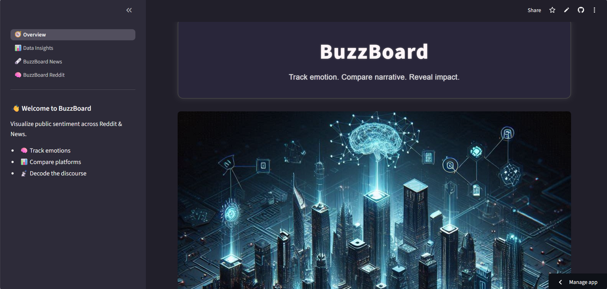
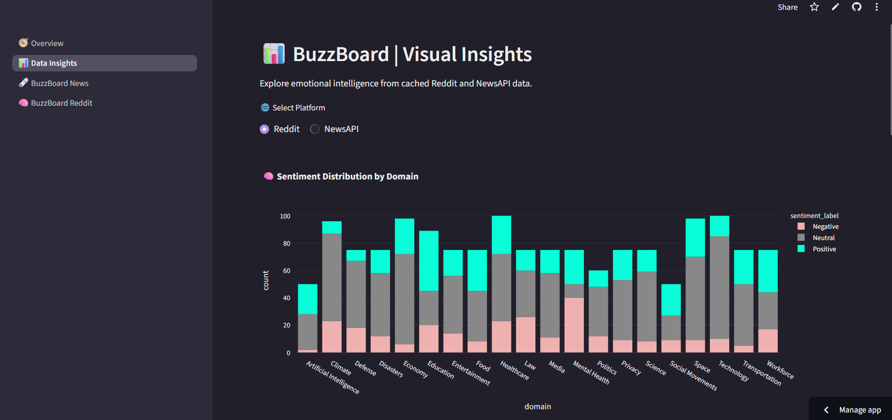
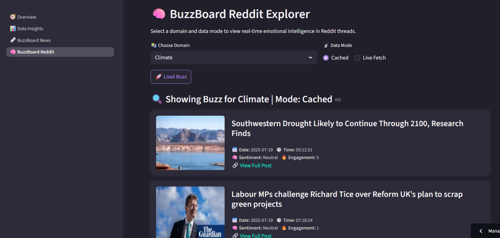

# 📊 BuzzBoard

 *Decode the discourse. Visualize how the internet feels.*  
BuzzBoard is a sentiment intelligence dashboard that blends Reddit discussions and NewsAPI articles to uncover emotional reactions, platform bias, and engagement trends — all visualized in an intuitive, aesthetically tuned interface.

-> Explore BuzzBoard : [Here !!!](https://buzz-board.streamlit.app/)
## 🖼️ Preview

### Homepage Overview
 

### Data Insights Overview
  

 ### BuzzBoard Reddit Explorer

 

---

## 🚀 Features

- 📡 Dual-source analysis: Reddit + NewsAPI  
- 🧠 Emotion & sentiment detection (curiosity, outrage, empathy, etc.)  
- 📈 Visual comparisons across platforms, domains, and sources  
- 🔄 Dynamic dashboards for engagement, tone, keywords, and bias  
- 🎨 Streamlit-powered UI with warm layout and sidebar messaging

---

## 💻 Tech Stack

- **Backend**: Python · pandas · Streamlit · Plotly  
- **NLP**: Custom sentiment logic · rule-based emotional scoring  
- **Data Pipeline**: Modular preprocessing via `Clean_LiveData.py`  
- **Visualization**: Interactive charts (bar, radar, heatmap, sentiment split)

---

## 📁 Folder Overview

## 🌐 Connect & Collaborate

Whether you’re interested in data storytelling, emotional dashboards, or platform discourse — I’d love to connect and explore new ideas together.

- 🧑‍💻 **GitHub**: [github.com/Hanni Kanchap](https://github.com/HanniKanchap)  
- 💼 **LinkedIn**: [linkedin.com/in/Hanni Kanchap](https://linkedin.com/in/hanni-kanchap)

  
**✨ BuzzBoard welcomes feedback, ideas, and contributions to expand emotional intelligence in tech.**

> 💬 Let’s collaborate on emotionally fluent design, scalable pipelines, and beautifully human insights.

## 💡 Inspiration

BuzzBoard began with a belief:  
**Data isn’t just statistical — it’s emotional.**

Every Reddit comment, every news article, carries a pulse.  
BuzzBoard blends media tone and public dialogue to show how the internet *feels* — one topic, one emotion, one platform at a time.

It’s more than sentiment analysis.  
It’s a window into human expression at scale.

> 🐝 Built with empathy, curiosity, and a passion for emotionally intelligent storytelling.
